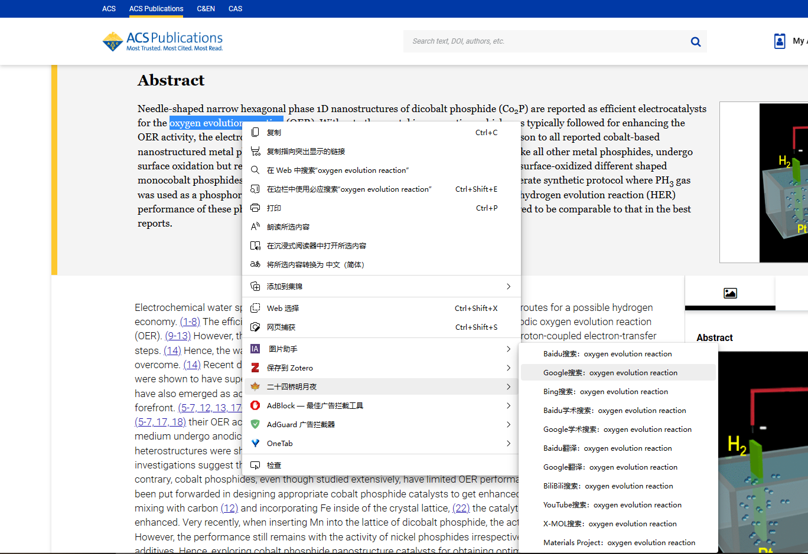

# Edge-extension-right_click_search

# 右键搜索神器"二十四桥明月夜" - 一个浏览器插件

"**二十四桥明月夜**"是一个方便快捷的浏览器插件，它可以帮助你在网页上直接搜索选中的文本，而不需要手动复制、打开搜索引擎页面、粘贴等繁琐的操作，节省您宝贵的时间和精力。目前支持以下搜索平台：

- 百度搜索
- 谷歌搜索
- 必应搜索
- 百度学术搜索
- 谷歌学术搜索
- 百度翻译
- 谷歌翻译
- 哔哩哔哩搜索
- YouTube搜索
- X-MOL搜索
- Materials Project晶体结构数据库搜索

## 安装

1. 克隆或下载本仓库
2. 在 Chrome 浏览器中打开 chrome://extensions/
3. 启用开发者模式
4. 点击“加载已解压的扩展程序”按钮
5. 选择下载的文件夹

## 使用方法

1. 在浏览器中打开任意网页
2. 选中你要搜索的文本
3. 右键点击选中的文本
4. 在弹出的右键菜单中选择“二十四桥明月夜”
5. 在子菜单中选择你要搜索的平台
6. 点击对应的子菜单项即可进行搜索

## 反馈和建议

如果您在使用过程中遇到任何问题，或者有任何建议和想法，请随时联系我们，我们将尽快回复您。您可以通过以下方式与我们联系：

- 发送电子邮件至liyihang@shu.edu.cn
- 在我们的GitHub仓库中提出问题

## 开发者

SearchRight是由liyihang开发的，如果您有任何开发相关的问题或建议，请联系我们，我们将非常乐意与您交流。

## 版权声明

SearchRight是一款完全免费的软件，遵循MIT许可证，可以在任意环境下自由使用、修改和分发。请在使用时遵守当地法律法规，本软件不承担任何法律责任。
